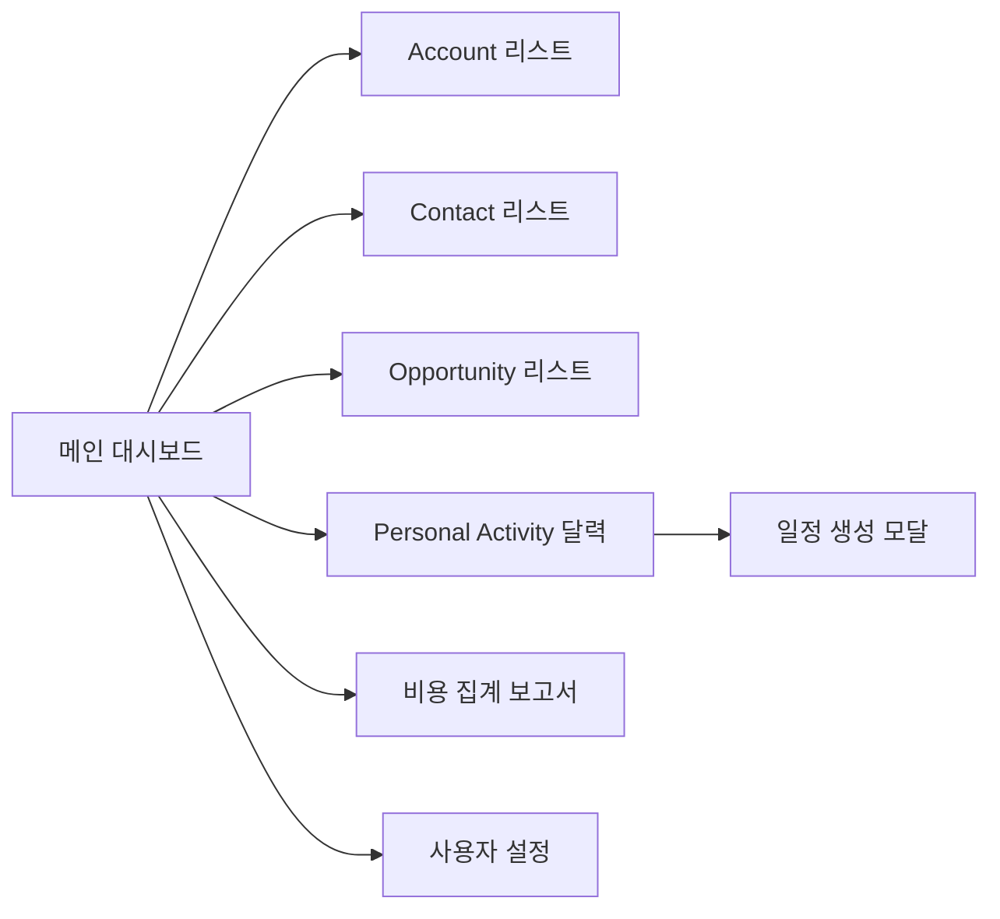

# Calendar_HW

```mermaid
flowchart LR
    A[메인 대시보드] --> B[Account 리스트]
    A --> C[Contact 리스트]
    A --> D[Opportunity 리스트]
    A --> E[Personal Activity 달력]
    A --> F[비용 집계 보고서]
    A --> G[사용자 설정]
    E --> H[일정 생성 모달]
```
